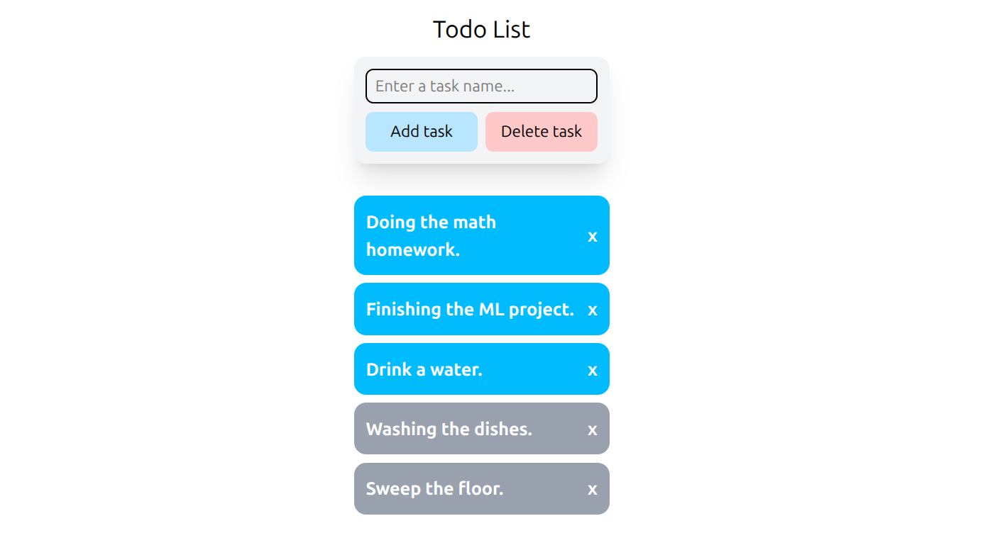

# 002 - Simple Todo Web App with Svelte



This project is a simple Todo web application built to demonstrate and practice fundamental frontend development concepts using the Svelte framework.

Svelte was chosen for its simplicity, powerful reactivity model (using Svelte 5 Runes), and excellent developer experience for building interactive user interfaces.

## Features

*   **Add Tasks:** Add new tasks to the list via an input field.
*   **Complete Tasks:** Mark tasks as complete or incomplete by clicking on them.
*   **Delete Tasks:** Toggle a "delete mode" to remove specific tasks.
*   **Automatic Sorting:** Completed tasks are automatically moved to the bottom of the list for better clarity.
*   **Input Validation:** Prevents empty or whitespace-only tasks from being added.

## Getting Started

To run this project locally, follow these steps:

1.  Clone the repository:
    ```bash
    git clone https://github.com/loselen-lu/mini-projects
    ```
2.  Navigate to the project directory:
    ```bash
    cd mini-projects/002-simple-todo-web
    ```
3.  Install the necessary dependencies:
    ```bash
    npm install
    ```
4.  Start the development server:
    ```bash
    npm run dev
    ```

## Project Structure

The core logic is contained within two main Svelte components located in the `src/lib/components/` directory:

*   `TodoItem.svelte`: Renders a single todo item and its state.
*   `TodoList.svelte`: Manages the state and rendering of the entire list.

These components are rendered on the main page via `src/routes/+page.svelte`.

## Component Breakdown

### 1. `TodoItem.svelte`

This component is responsible for rendering a single todo item. It is designed to be a "dumb" component, meaning it only displays data passed to it via props and emits events back to its parent.

*   **Display Modes:** The component's appearance is controlled by a `mode` prop.
    *   `mode: 0` (default): A standard view showing the task name.
    *   `mode: 1` (deletion mode): Reveals a delete button (`x`).
*   **Visual State:** The background color changes based on the `completed` prop to visually distinguish between active and completed tasks.
*   **Parent-Child Communication:** It accepts a `handleDelete` function as a prop. This allows the parent component (`TodoList`) to manage the application's state, promoting a clear, one-way data flow.

#### Code Snippet

```svelte
<script lang="ts">
	interface Props {
		name: string;
		completed?: boolean;
		mode?: number;
		handleDelete?: (id?: number) => void;
	}

	let { name, completed = false, mode = 0, handleDelete = () => {} }: Props = $props();
</script>

{#if mode === 0}
	<div
		class="flex w-full p-3 rounded-xl text-white text-lg font-bold {!completed
			? 'bg-sky-400'
			: 'bg-gray-400'}"
	>
		{name}
	</div>
{:else}
	<div
		class="flex w-full p-3 rounded-xl text-white text-lg font-bold {!completed
			? 'bg-sky-400'
			: 'bg-gray-400'}"
	>
		<span class="text-left w-[90%]">{name}</span>
		<button class="text-right w-[10%]" onclick={() => handleDelete()}>x</button>
	</div>
{/if}
```

### 2. `TodoList.svelte`

This is the main component that manages the list's state and orchestrates user interactions.

*   **State Management:** Svelte 5 Runes are used for clean and efficient reactivity.
    *   `$state(task)`: Holds the value of the new task input field, bound with `bind:value`.
    *   `$state(tasks)`: An array of task objects (`{ taskName: string, isCompleted: boolean }`).
    *   `$state(mode)`: Controls the UI mode (`0` for normal, `1` for deletion). A number is used here to allow for potential future expansion with other modes (e.g., an 'edit' mode).
*   **Rendering Logic:** To improve readability, tasks are rendered in two groups: active tasks first, followed by completed tasks. This is achieved by iterating through the `tasks` array twice with separate `{#each}` blocks, each filtering by the `isCompleted` status.
*   **Deletion Logic:** The `toggleDeleteMode` function switches the `mode` state. When in deletion mode, the `mode` prop is passed down to each `TodoItem`, and the `handleDelete` prop is passed a function that removes the selected task from the `tasks` array using its `index` and the `splice` method.

#### Code Snippet
```svelte
<script lang="ts">
	import TodoItem from './TodoItem.svelte';

	interface taskProps {
		taskName: string;
		isCompleted: boolean;
	}

	let task: string = $state('');
	let tasks: taskProps[] = $state([]);
	let mode = $state(0);

	function onclick() {
		let task_trim = task.trim();
		if (task_trim) {
			tasks.push({ taskName: task_trim, isCompleted: false });
		}
		task = '';
	}

	function onkeydown(event: KeyboardEvent) {
		if (event.key === 'Enter') {
			onclick();
		}
	}

	function toggleComplete(a_task: taskProps) {
		a_task.isCompleted = !a_task.isCompleted;
	}

	function toggleDeleteMode() {
		if (mode === 0) {
			mode = 1;
		} else {
			mode = 0;
		}
	}

	$inspect(tasks);
</script>

<div class="w-full flex flex-col items-center gap-3 justify-center p-4">
	<h1 class="font-semi text-2xl">Todo List</h1>

	<div class="flex flex-col gap-8 w-64">
		<div class="w-full bg-gray-100 p-3 shadow-xl rounded-xl grid grid-cols-2 gap-2">
			<input
				type="text"
				{onkeydown}
				bind:value={task}
				class="w-full border-2 border-black rounded-lg py-1 px-2 col-span-2"
				placeholder="Enter a task name..."
			/>
			<button class="bg-sky-200 p-2 rounded-lg" {onclick}>Add task</button>
			<button class="bg-red-200 p-2 rounded-lg" onclick={toggleDeleteMode}>Delete task</button>
		</div>

		<div class="flex flex-col gap-2">
			{#if mode === 0}
				{#each tasks as single_task}
					{#if !single_task.isCompleted}
						<button onclick={() => toggleComplete(single_task)}>
							<TodoItem name={single_task.taskName} completed={single_task.isCompleted} />
						</button>
					{/if}
				{/each}
				{#each tasks as single_task}
					{#if single_task.isCompleted}
						<button onclick={() => toggleComplete(single_task)}>
							<TodoItem name={single_task.taskName} completed={single_task.isCompleted} />
						</button>
					{/if}
				{/each}
			{:else}
				{#each tasks as single_task, index}
					{#if !single_task.isCompleted}
						<button onclick={() => toggleComplete(single_task)}>
							<TodoItem
								name={single_task.taskName}
								completed={single_task.isCompleted}
								mode={1}
								handleDelete={() => tasks.splice(index, 1)}
							/>
						</button>
					{/if}
				{/each}
				{#each tasks as single_task, index}
					{#if single_task.isCompleted}
						<button onclick={() => toggleComplete(single_task)}>
							<TodoItem
								name={single_task.taskName}
								completed={single_task.isCompleted}
								mode={1}
								handleDelete={() => tasks.splice(index, 1)}
							/>
						</button>
					{/if}
				{/each}
			{/if}
		</div>
	</div>
</div>
```

## Conclusion and Future Work

This project served as an excellent introduction to frontend development, providing a practical understanding of component-based architecture, state management with Svelte Runes, and props-based communication.

Future plans for expanding on these concepts include:
1.  **Backend Integration:** Implement a simple backend (e.g., using Node.js/Express) to persist tasks in a database.
2.  **API Consumption:** Integrate a third-party API, such as a weather API, to display additional information.
3.  **UI for Machine Learning:** Develop a graphical user interface (GUI) for interacting with a machine learning model.