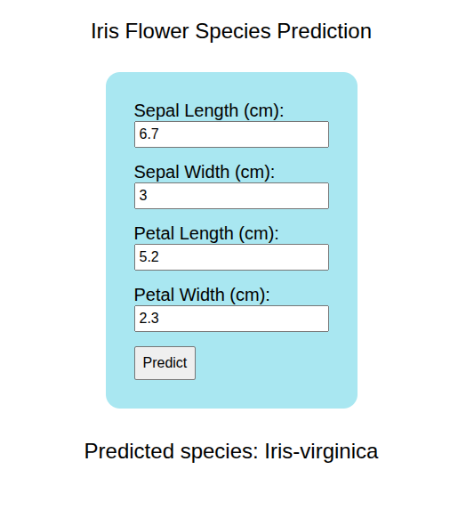

# 003 - Iris Species Predictor Web App



This project is a simple machine learning web application that predicts the species of an Iris flower based on its sepal and petal measurements.

It demonstrates a complete, end-to-end machine learning workflow, from training a model with Scikit-learn to deploying it as an interactive web service using Flask. The goal is to provide a clear example of how to operationalize a predictive model.

## Features

*   **Predictive Model:** Utilizes a Support Vector Machine (SVM) model trained on the classic Iris dataset.
*   **Web Interface:** A clean, user-friendly HTML form for inputting flower measurements.
*   **Real-time Prediction:** Submitting the measurements returns an instant species prediction on the same page.
*   **Full Stack Implementation:** Combines a Python/Flask backend for logic and a simple HTML/CSS frontend for user interaction.

## Getting Started

To run this project locally, follow these steps:

1.  **Clone the repository:**
    ```bash
    git clone https://github.com/loselen-lu/mini-projects
    ```
2.  **Navigate to the project directory:**
    ```bash
    cd mini-projects/003-iris-flower-classifier-gui
    ```
3.  **Install the necessary dependencies:**
    ```bash
    pip install flask scikit-learn pandas numpy joblib
    ```
4.  **(Optional) Train the model:** The repository includes a pre-trained `model.joblib`. To retrain it yourself, run the `main.ipynb` notebook in a Jupyter environment. This will overwrite the existing model file.

5.  **Start the Flask development server:**
    ```bash
    python app.py
    ```
6.  Open your web browser and go to `http://127.0.0.1:5000` to use the application.

## Project Structure

The project requires a specific directory layout for the Flask application to find the HTML template. The `index.html` file must be placed inside a folder named `templates`.

```
003-iris-flower-classifier-gui/
├── templates/
│   └── index.html
├── app.py
├── main.ipynb
├── model.joblib
└── IRIS.csv
```

*   `main.ipynb`: A Jupyter Notebook containing the complete machine learning model training process.
*   `IRIS.csv`: The dataset used for training and evaluating the model.
*   `model.joblib`: The serialized, pre-trained Scikit-learn model ready for use.
*   `app.py`: The Flask web server that handles user requests, processes inputs, and serves predictions.
*   `templates/index.html`: The HTML template that provides the frontend user interface.

## File Breakdown

### 1. `main.ipynb` (Model Training)

This notebook walks through the entire process of creating the prediction model.

*   **Data Loading:** The `IRIS.csv` dataset is loaded into a pandas DataFrame. The data is sourced from the [Iris Flower Dataset on Kaggle](https://www.kaggle.com/datasets/arshid/iris-flower-dataset).
*   **Data Preparation:** The data is split into features (X) and the target label (y). It is then divided into training and testing sets using Scikit-learn's `train_test_split`.
*   **Model Training:** A `LinearSVC` (Linear Support Vector Classifier) model is instantiated and trained on the training data.
*   **Evaluation:** The model's accuracy is calculated using the test set to ensure it performs well on unseen data.
*   **Serialization:** The trained model is saved to a file named `model.joblib` using the `joblib` library, allowing it to be easily loaded into another application without retraining.

#### Code Snippet (Training and Saving)
```python
from sklearn.svm import LinearSVC
from sklearn.model_selection import train_test_split
import pandas as pd
import joblib

# Load and split data
iris_data_pd = pd.read_csv('IRIS.csv')
X_train, X_test, y_train, y_test = train_test_split(
    iris_data_pd.iloc[:, :4], 
    iris_data_pd.iloc[:, 4], 
    test_size=0.2, 
    random_state=5
)

# Create and train the model
model = LinearSVC()
model.fit(X_train, y_train)

# Evaluate the model
print(f"Model Score: {model.score(X_test, y_test)}")

# Save the trained model to a file
joblib.dump(model, 'model.joblib')
```

### 2. `app.py` (Flask Backend)

This script is the heart of the web application. It uses the Flask framework to create a web server.

*   **Initialization:** It initializes a Flask app and loads the pre-trained `model.joblib` file on startup.
*   **Home Route (`/`):** The main route renders the `index.html` page, presenting the input form to the user.
*   **Prediction Route (`/predict`):** This route is configured to accept `POST` requests from the HTML form. It retrieves the four input values, converts them into a numeric format suitable for the model, and then calls the `model.predict()` method. The resulting prediction is formatted into a string and passed back to the `index.html` template for display.

#### Code Snippet (Prediction Route)
```python
from flask import Flask, request, render_template
import joblib
import numpy as np

app = Flask(__name__)

# Loadng the trained model
model = joblib.load('model.joblib')

@app.route('/predict', methods=['POST'])
def predict():
    # Getting the inputs from the form
    input_features = [float(x) for x in request.form.values()]
    
    # Making a prediction using the model
    predicted_class = model.predict([input_features])[0]

    # Formatting the output text
    prediction_text = f'Predicted species: {predicted_class}'

    # Rendering the home page with the prediction result
    return render_template('index.html', prediction_text=prediction_text)
```

### 3. `templates/index.html` (Frontend)

This file defines the structure and appearance of the web page.

*   **Input Form:** It contains a simple HTML `<form>` with four `input` fields of `type="number"` for sepal length, sepal width, petal length, and petal width.
*   **Data Submission:** The form's `action` attribute is set to `{{ url_for('predict') }}`, a Jinja2 expression that dynamically generates the URL for the `/predict` route in the Flask app. This ensures the form data is sent to the correct endpoint.
*   **Result Display:** The prediction result is displayed using the Jinja2 placeholder `{{ prediction_text }}`. When the page is re-rendered after a prediction, Flask replaces this placeholder with the actual prediction string.

#### Code Snippet (HTML Form)
```html
<div class="form-container">
    <!-- Sending the predict inputs to the /predict URL -->
    <form action="{{ url_for('predict') }}" method="post">
        <label>Sepal Length (cm):</label><br>
        <input type="number" step="0.1" name="sepal_length" required="required" /><br>
        <label>Sepal Width (cm):</label><br>
        <input type="number" step="0.1" name="sepal_width" required="required" /><br>
        <label>Petal Length (cm):</label><br>
        <input type="number" step="0.1" name="petal_length" required="required" /><br>
        <label>Petal Width (cm):</label><br>
        <input type="number" step="0.1" name="petal_width" required="required" /><br>
        <button type="submit">Predict</button>
    </form>
</div>

<!-- Printing the prediction result in this div -->
<div class="result">
    {{ prediction_text }}
</div>
```

## Conclusion and Future Work

This project successfully builds and deploys a simple machine learning model as a web application. It serves as a foundational example for MLOps practices, bridging the gap between model development and practical application.

Future improvements could include:
1.  **Model Enhancement:** Experiment with other classification algorithms (e.g., Random Forest, Gradient Boosting) to potentially improve accuracy.
2.  **UI/UX Improvements:** Enhance the frontend with a more modern framework (like React or Svelte), add data visualizations, or display an image of the predicted flower species.
3.  **Cloud Deployment:** Deploy the application to a cloud platform like Heroku, AWS, or Google Cloud Platform to make it publicly accessible.
4.  **API-first Design:** Refactor the backend to expose a RESTful API for predictions, separating the frontend from the model-serving logic.